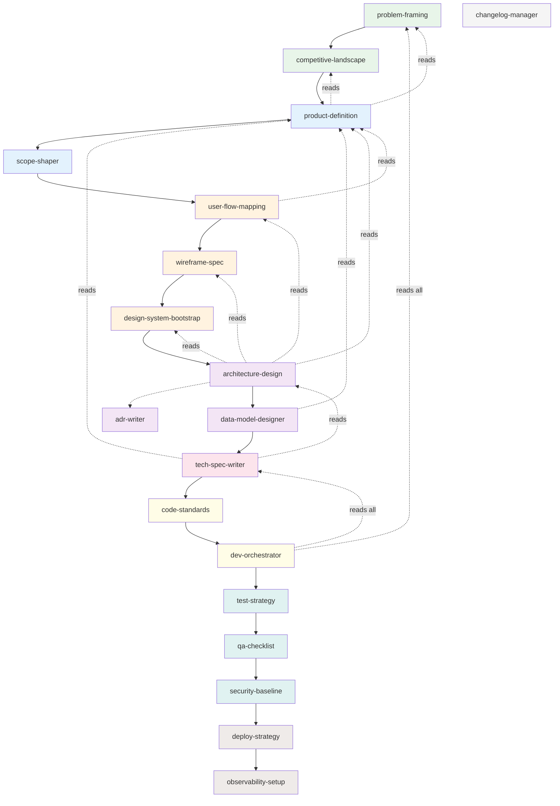

# Phase Dependency Map

Complete dependency graph between all 17 skills and 2 agents in the Forge pipeline.

---

## 1. Dependency Graph (Text)

### Phase 0 — Discovery
- **problem-framing** → no dependencies (starting point)
- **competitive-landscape** → depends on `problem-statement.md` (approved)

### Phase 1 — Product
- **product-definition** → depends on `problem-statement.md` + `landscape-analysis.md` (both approved)
- **scope-shaper** (agent) → depends on `prd.md` + `user-story-map.md` (both approved)

### Phase 2 — Design
- **user-flow-mapping** → depends on `prd.md` + `mvp-definition.md` (both approved)
- **wireframe-spec** → depends on `user-flows.md`
- **design-system-bootstrap** → depends on `wireframes/` (at least 1 wireframe)

### Phase 3 — Architecture
- **architecture-design** → depends on PRD, user flows, wireframes, design system, design tokens (all approved)
  - Triggers `adr-writer` for each significant decision
- **adr-writer** → depends on decision context (invoked by other skills, not standalone)
- **data-model-designer** → depends on `architecture-overview.md` + `prd.md` (both approved)

### Phase 4 — Specs
- **tech-spec-writer** → depends on `data-model.md` + `architecture-overview.md` + `prd.md` (all approved)

### Phase 5 — Implementation
- **code-standards** → depends on `architecture-overview.md`
- **dev-orchestrator** (agent) → depends on ALL artifacts from phases 0-4 + `code-standards.md`

### Phase 6 — Quality
- **test-strategy** → depends on `architecture-overview.md` + `features/*.md`
- **qa-checklist** → no strict dependency (can be generated early, customized later)
- **security-baseline** → depends on `architecture-overview.md`

### Phase 7 — Deploy
- **deploy-strategy** → depends on `architecture-overview.md`
- **observability-setup** → depends on `architecture-overview.md` + `deploy-strategy.md`

### Transversal
- **changelog-manager** → depends on `CHANGELOG.md` existing; invoked by `forge:advance`

---

## 2. Dependency Diagram (Mermaid)

---

## 3. Skill Dependency Table

| Skill / Agent | Depends On (artifacts) | Produces (artifacts) |
|---------------|----------------------|---------------------|
| `problem-framing` | *(none — entry point)* | `00-discovery/problem-statement.md` |
| `competitive-landscape` | `problem-statement.md` ✅ | `00-discovery/landscape-analysis.md` |
| `product-definition` | `problem-statement.md` ✅, `landscape-analysis.md` ✅ | `01-product/prd.md`, `01-product/user-story-map.md` |
| `scope-shaper` | `prd.md` ✅, `user-story-map.md` ✅ | `01-product/shaped-pitch.md`, `01-product/mvp-definition.md` |
| `user-flow-mapping` | `prd.md` ✅, `mvp-definition.md` ✅ | `02-design/user-flows.md`, `02-design/user-flows.mermaid` |
| `wireframe-spec` | `user-flows.md` | `02-design/wireframes/*.md` |
| `design-system-bootstrap` | `wireframes/` (1+ file) | `02-design/design-system.md`, `02-design/design-tokens.json` |
| `architecture-design` | PRD ✅, user flows ✅, wireframes ✅, design system ✅, design tokens ✅ | `03-architecture/architecture-overview.md`, `c4-*.mermaid` (x3) |
| `adr-writer` | decision context (invoked) | `03-architecture/adrs/NNN-titulo.md` |
| `data-model-designer` | `architecture-overview.md` ✅, `prd.md` ✅ | `03-architecture/data-model.md`, `data-model.mermaid` |
| `tech-spec-writer` | `data-model.md` ✅, `architecture-overview.md` ✅, `prd.md` ✅ | `04-specs/features/*.md` |
| `code-standards` | `architecture-overview.md` | `05-implementation/code-standards.md` + configs |
| `dev-orchestrator` | ALL artifacts phases 0-4 + `code-standards.md` | `05-implementation/implementation-plan.md` |
| `test-strategy` | `architecture-overview.md`, `features/*.md` | `06-quality/test-strategy.md` |
| `qa-checklist` | *(none strictly required)* | `06-quality/qa-checklist.md` |
| `security-baseline` | `architecture-overview.md` | `06-quality/security-baseline.md` |
| `deploy-strategy` | `architecture-overview.md` | `07-deploy/deploy-strategy.md` |
| `observability-setup` | `architecture-overview.md`, `deploy-strategy.md` | `07-deploy/observability-setup.md` |
| `changelog-manager` | `CHANGELOG.md` exists | `CHANGELOG.md` (updated) |

**Legend:** ✅ = must be `approved` before skill can execute
