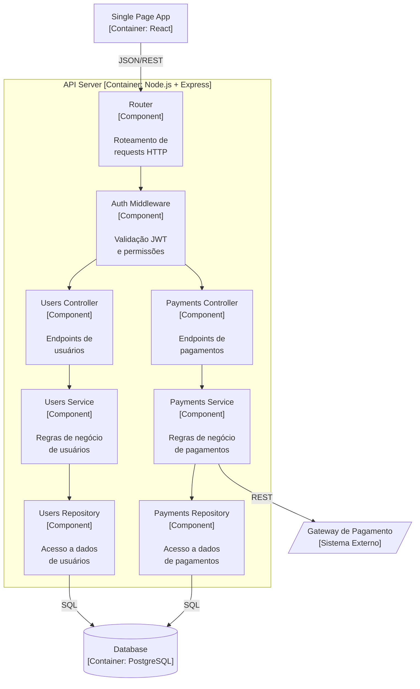

# C4 Model — Guia Prático com Mermaid

> Referência para a skill `architecture-design`.
> Baseado em: Simon Brown — *The C4 Model for Visualising Software Architecture* — https://c4model.com/

---

## Sumário

1. [O que é o C4 Model](#1-o-que-é-o-c4-model)
2. [Level 1 — System Context](#2-level-1--system-context)
3. [Level 2 — Containers](#3-level-2--containers)
4. [Level 3 — Components](#4-level-3--components)
5. [Convenções Mermaid](#5-convenções-mermaid)
6. [Dicas para Diagramas Legíveis](#6-dicas-para-diagramas-legíveis)
7. [Erros Comuns](#7-erros-comuns)

---

## 1. O que é o C4 Model

O C4 Model organiza a visualização de arquitetura de software em 4 níveis de zoom progressivo:

| Nível | Foco | Audiência | Analogia |
|-------|------|-----------|----------|
| **1 — Context** | Sistema + mundo externo | Todos (técnico e não-técnico) | Google Maps — país inteiro |
| **2 — Containers** | Unidades deployáveis dentro do sistema | Equipe técnica | Google Maps — cidade |
| **3 — Components** | Módulos dentro de cada container | Desenvolvedores | Google Maps — ruas |
| **4 — Code** | Classes/funções | Desenvolvedores (opcional) | Google Maps — prédio |

No Forge, geramos os níveis 1-3. O nível 4 (Code) é detalhado demais para a fase de arquitetura e emerge naturalmente durante a implementação.

---

## 2. Level 1 — System Context

### O que mostrar

- O **sistema** sendo construído (caixa central)
- **Pessoas/atores** que usam o sistema (extraídos das personas do PRD)
- **Sistemas externos** com os quais o sistema se comunica (APIs, serviços de terceiros)
- **Relações** com labels descritivos (o que flui entre eles)

### O que NÃO mostrar

- Detalhes internos do sistema
- Tecnologias específicas
- Protocolos de comunicação

### Exemplo Mermaid

```mermaid
flowchart TD
    subgraph external [Sistemas Externos]
        GATEWAY[/"Gateway de Pagamento\n[Sistema Externo]"/]
        EMAIL[/"Serviço de Email\n[Sistema Externo]"/]
    end

    USER([("Usuário Final\n[Persona]")])
    ADMIN([("Administrador\n[Persona]")])

    SYSTEM["Sistema XYZ\n[Sistema Principal]\n\nDescrição curta do que\no sistema faz"]

    USER -->|"Acessa via browser\npara realizar tarefas"| SYSTEM
    ADMIN -->|"Gerencia configurações\ne usuários"| SYSTEM
    SYSTEM -->|"Processa pagamentos\nvia API REST"| GATEWAY
    SYSTEM -->|"Envia notificações\ntransacionais"| EMAIL
```

### Convenções

- Sistema principal: retângulo com `[Sistema Principal]` no subtitle
- Atores: retângulo arredondado com `[Persona]` no subtitle
- Sistemas externos: paralelogramo com `[Sistema Externo]` no subtitle
- Labels nas setas: descrever O QUE flui, não COMO (sem mencionar JSON, HTTP, etc.)

---

## 3. Level 2 — Containers

### O que mostrar

- **Containers** dentro do sistema: cada unidade que roda separadamente (frontend, backend, banco, workers)
- **Tecnologia** de cada container (entre colchetes no subtitle)
- **Responsabilidade** de cada container (descrição curta)
- **Comunicação** entre containers: protocolo + formato
- Atores e sistemas externos do Level 1 (repetidos como contexto)

### O que NÃO mostrar

- Módulos/classes internos de cada container
- Detalhes de implementação

### Exemplo Mermaid

```mermaid
flowchart TD
    USER([("Usuário Final\n[Persona]")])

    subgraph system ["Sistema XYZ [Sistema Principal]"]
        SPA["Single Page App\n[Container: React]\n\nInterface do usuário\nno browser"]
        API["API Server\n[Container: Node.js + Express]\n\nLógica de negócio\ne endpoints REST"]
        DB[("Database\n[Container: PostgreSQL]\n\nArmazena dados\nde usuários e transações")]
        CACHE[("Cache\n[Container: Redis]\n\nSessões e cache\nde consultas frequentes")]
        WORKER["Background Worker\n[Container: Node.js]\n\nProcessa tarefas\nassíncronas (emails, reports)"]
        QUEUE[("Message Queue\n[Container: Redis/BullMQ]\n\nFila de tarefas\nassíncronas")]
    end

    GATEWAY[/"Gateway de Pagamento\n[Sistema Externo]"/]

    USER -->|"HTTPS"| SPA
    SPA -->|"JSON/REST"| API
    API -->|"SQL"| DB
    API -->|"GET/SET"| CACHE
    API -->|"Enqueue job"| QUEUE
    QUEUE -->|"Dequeue job"| WORKER
    WORKER -->|"SQL"| DB
    API -->|"REST/HTTPS"| GATEWAY
```

### Convenções

- Aplicações (frontend, backend, workers): retângulos
- Bancos de dados e stores: cilindros `[("...")]`
- Filas: cilindros `[("...")]`
- Sistemas externos: paralelogramos (mesmo estilo do Level 1)
- Subtitle: `[Container: Tecnologia]`
- Labels nas setas: protocolo ou formato (`JSON/REST`, `SQL`, `HTTPS`, `gRPC`)
- `subgraph` para agrupar tudo que faz parte do sistema

---

## 4. Level 3 — Components

### O que mostrar

- **Componentes/módulos** dentro de um container específico (geralmente o backend)
- **Responsabilidade** de cada componente
- **Dependências** entre componentes (quem chama quem)
- Containers vizinhos e sistemas externos como contexto

### O que NÃO mostrar

- Código ou classes individuais
- Detalhes de framework (middleware internos, etc.)

### Exemplo Mermaid



### Convenções

- Todos os componentes: retângulos com `[Component]` no subtitle
- Organizar visualmente por camada: Controllers → Services → Repositories (top-down)
- `subgraph` para delimitar o container que está sendo detalhado
- Containers e sistemas externos fora do subgraph
- Fluxo top-down (`flowchart TD`) para representar a cadeia de chamadas

---

## 5. Convenções Mermaid

### Formas por tipo de elemento

| Elemento | Forma Mermaid | Exemplo |
|----------|---------------|---------|
| Sistema / Container / Componente | Retângulo `["..."]` | `API["API Server\n[Container: Node.js]"]` |
| Banco de dados / Store / Cache | Cilindro `[("...")]` | `DB[("PostgreSQL\n[Container: PostgreSQL]")]` |
| Pessoa / Ator | Retângulo arredondado `([("...")])` | `USER([("Usuário\n[Persona]")])` |
| Sistema externo | Paralelogramo `[/"..."/]` | `EXT[/"Stripe\n[Sistema Externo]"/]` |
| Início / Fim | Stadium `(["..."])` | `START(["Início"])` |

### Direção

- Usar `flowchart TD` (top-down) como padrão
- `flowchart LR` (left-right) apenas se o diagrama ficar muito vertical

### Labels nas setas

```mermaid
A -->|"label descritivo"| B
```

- Level 1: descrever O QUE flui ("Dados de pedido", "Notificação de pagamento")
- Level 2: protocolo + formato ("JSON/REST", "SQL", "gRPC/protobuf")
- Level 3: sem label para chamadas internas simples, com label apenas para comunicação cross-boundary

### Subgraphs

```mermaid
subgraph nome_do_grupo ["Label Visível [Tipo]"]
    ...nós internos...
end
```

- Level 2: subgraph para delimitar o sistema
- Level 3: subgraph para delimitar o container sendo detalhado

---

## 6. Dicas para Diagramas Legíveis

1. **Máximo 12-15 elementos por diagrama.** Se passar disso, é sinal de que o nível de detalhe está errado — suba ou desça um nível.

2. **Um propósito por diagrama.** Não misture níveis C4 no mesmo diagrama. Context é Context, Containers é Containers.

3. **Labels curtos.** Máximo 3-4 palavras no nome do elemento. Usar o campo de descrição (linhas com `\n`) para detalhes.

4. **Consistência de nomes.** O nome de um container no Level 2 deve ser idêntico ao nome do subgraph no Level 3. O nome de um ator no Level 1 deve ser idêntico ao rótulo no Level 2.

5. **Direção do fluxo = direção da dependência.** Em `flowchart TD`, setas para baixo representam chamadas/dependências. Evitar setas para cima (contra-fluxo).

6. **Sem cruzamento de setas.** Reorganizar os nós para minimizar cruzamentos. Se inevitável, usar subgraphs para agrupar nós relacionados.

7. **Cores e estilos (opcional).** Mermaid suporta `style` e `classDef` para diferenciar tipos:

```mermaid
classDef external fill:#f9f,stroke:#333
classDef database fill:#bbf,stroke:#333
```

8. **Testar renderização.** Colar o Mermaid em https://mermaid.live/ para verificar que renderiza sem erros antes de salvar.

---

## 7. Erros Comuns

| Erro | Problema | Correção |
|------|----------|----------|
| Diagrama único com 30+ elementos | Ilegível, sem zoom progressivo | Separar em 3 diagramas (um por nível C4) |
| Mostrar classes no Level 2 | Detalhe excessivo para o nível | Mover para Level 3 ou Level 4 |
| Labels com frases longas | Poluição visual | Usar 3-4 palavras, detalhes no description |
| Nomes diferentes para o mesmo elemento entre níveis | Inconsistência confunde o leitor | Usar exatamente o mesmo nome em todos os níveis |
| Misturar protocolo e propósito nos labels | "Envia JSON com dados de pagamento via REST" | Level 1: "Dados de pagamento". Level 2: "JSON/REST" |
| Setas bidirecionais | Ambiguidade sobre quem inicia | Usar seta unidirecional do chamador para o chamado |
| Esquecer sistemas externos | Arquitetura parece isolada | Sempre mostrar o ecossistema completo no Level 1 |
