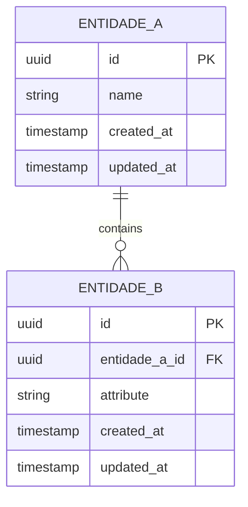

# Data Model — <PROJECT_NAME>

> **Fase:** Architecture
> **Skill:** data-model-designer
> **Status:** draft
> **Data:** <YYYY-MM-DD>

---

## Resumo

<!-- 1 parágrafo: quantas entidades, domínio coberto, tipo de banco escolhido. -->

<RESUMO_DO_MODELO>

---

## Entidades

<!-- Uma sub-seção por entidade. Atributos em tabela com tipo adequado ao banco da arquitetura. -->

### <NOME_ENTIDADE_1>

<!-- Descrição de 1 frase: o que esta entidade representa no domínio. -->

<DESCRICAO_BREVE>

| Atributo | Tipo | Constraint | Descrição |
|----------|------|-----------|-----------|
| `id` | `<TIPO_PK>` | PK | Identificador único |
| `<ATRIBUTO_1>` | `<TIPO>` | <CONSTRAINT> | <DESCRICAO> |
| `<ATRIBUTO_2>` | `<TIPO>` | <CONSTRAINT> | <DESCRICAO> |
| `created_at` | `<TIPO_TIMESTAMP>` | NOT NULL, DEFAULT now() | Data de criação |
| `updated_at` | `<TIPO_TIMESTAMP>` | NOT NULL, DEFAULT now() | Data da última atualização |

<!-- Se soft-delete: adicionar deleted_at nullable -->
<!-- Repetir sub-seção para cada entidade -->

### <NOME_ENTIDADE_2>

<DESCRICAO_BREVE>

| Atributo | Tipo | Constraint | Descrição |
|----------|------|-----------|-----------|
| `id` | `<TIPO_PK>` | PK | Identificador único |
| `<FK_ENTIDADE_1>_id` | `<TIPO_FK>` | FK → <ENTIDADE_1>.id, NOT NULL | Referência a <ENTIDADE_1> |
| `<ATRIBUTO_1>` | `<TIPO>` | <CONSTRAINT> | <DESCRICAO> |
| `created_at` | `<TIPO_TIMESTAMP>` | NOT NULL, DEFAULT now() | Data de criação |
| `updated_at` | `<TIPO_TIMESTAMP>` | NOT NULL, DEFAULT now() | Data da última atualização |

<!-- Adicionar mais entidades conforme necessário. -->

---

## Relacionamentos

<!-- Tabela consolidada de todos os relacionamentos entre entidades. -->

| Entidade A | Relação | Entidade B | FK em | Cascade Rule |
|-----------|---------|-----------|-------|-------------|
| <ENTIDADE_A> | 1:N | <ENTIDADE_B> | <ENTIDADE_B>.<FK> | <ON DELETE CASCADE / SET NULL / RESTRICT> |
| <ENTIDADE_C> | N:N | <ENTIDADE_D> | <TABELA_JUNCAO> | <CASCADE_RULE> |
| <ENTIDADE_E> | 1:1 | <ENTIDADE_F> | <ENTIDADE_F>.<FK> | <CASCADE_RULE> |

<!-- Para N:N: documentar a tabela de junção como entidade própria na seção Entidades acima. -->

---

## Índices

<!-- Índices além das PKs (automáticas). Justificar cada um com base em queries esperadas. -->

| Entidade | Coluna(s) | Tipo | Justificativa |
|----------|----------|------|---------------|
| <ENTIDADE> | `<COLUNA_FK>` | btree | FK lookup |
| <ENTIDADE> | `<COLUNA_BUSCA>` | btree | Filtro frequente em listagem |
| <ENTIDADE> | `<COLUNA_1>`, `<COLUNA_2>` | btree (composto) | Query combina ambos filtros |
| <ENTIDADE> | `<COLUNA_UNIQUE>` | unique | Constraint de unicidade do domínio |
| <ENTIDADE> | `<COLUNA_TEXTO>` | gin / gist | Busca textual (se aplicável) |

---

## Notas de Normalização

<!-- Documentar o nível de normalização (3NF padrão) e quaisquer desnormalizações conscientes. -->

### Nível de Normalização

O modelo segue a **Terceira Forma Normal (3NF)** como baseline:
- 1NF: todos os atributos são atômicos
- 2NF: sem dependências parciais
- 3NF: sem dependências transitivas

### Desnormalizações

<!-- Se nenhuma: "Nenhuma desnormalização necessária neste modelo."
     Se houver: documentar cada uma com referência ao ADR correspondente. -->

| Campo Desnormalizado | Entidade | Justificativa | ADR |
|---------------------|----------|--------------|-----|
| `<CAMPO>` | `<ENTIDADE>` | <MOTIVO: performance, simplificação de query, etc.> | [ADR-<NNN>](adrs/<NNN>-<titulo>.md) |

---

## Diagrama ER

<!-- Referência ao diagrama Mermaid gerado separadamente. -->

O diagrama ER completo está em [`data-model.mermaid`](data-model.mermaid).

<!-- Substituir pelo diagrama real do projeto. -->

---

## Referências

- [PRD](../../01-product/prd.md) — entidades e user stories de origem
- [Architecture Overview](architecture-overview.md) — banco, ORM, estratégia de dados
- [ADRs](adrs/) — decisões de desnormalização

---

## Status

- **Criado em:** <YYYY-MM-DD>
- **Última atualização:** <YYYY-MM-DD>
- **Status:** draft
- **Aprovado por:** —
- **Data de aprovação:** —
